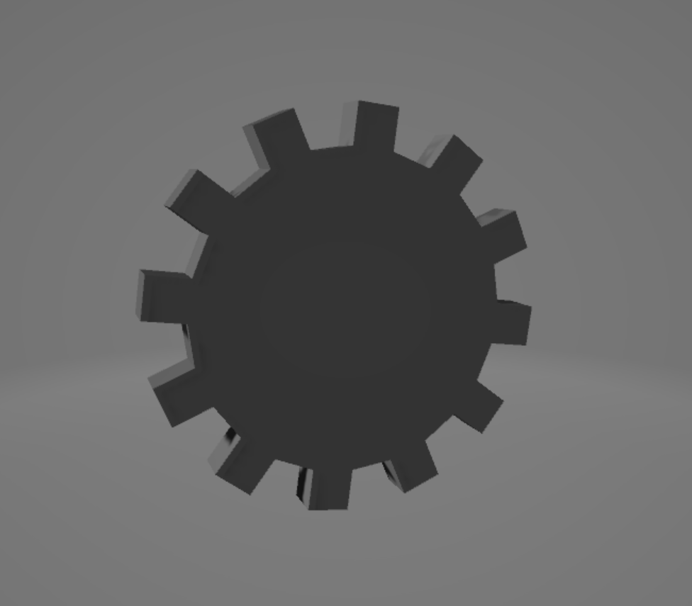

# Gear(Cog) Generator

Python script that generates a 3D model(`.obj`) of a N-toothed gear.

## How to use

Run `run.bat` and enter the tooth count. Then it will generate `N-toothed cog.obj` in same directory.

The below example shows generated 12-toothed cogwheel.

## Source code

See [m.py](m.py)